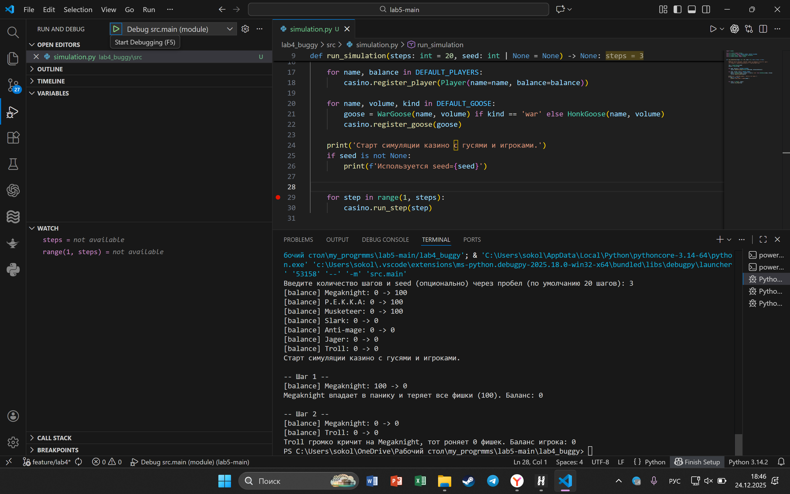
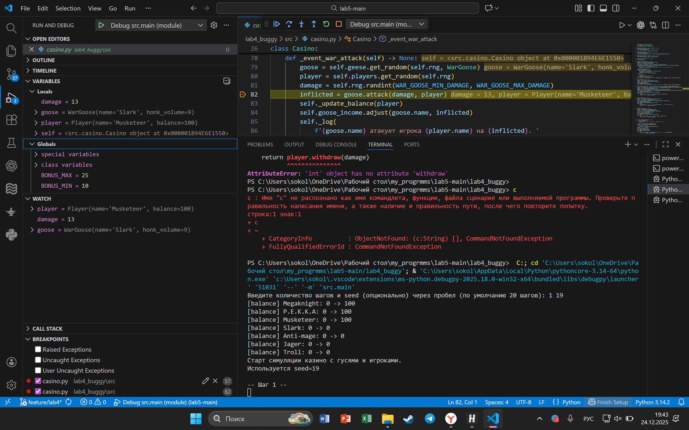
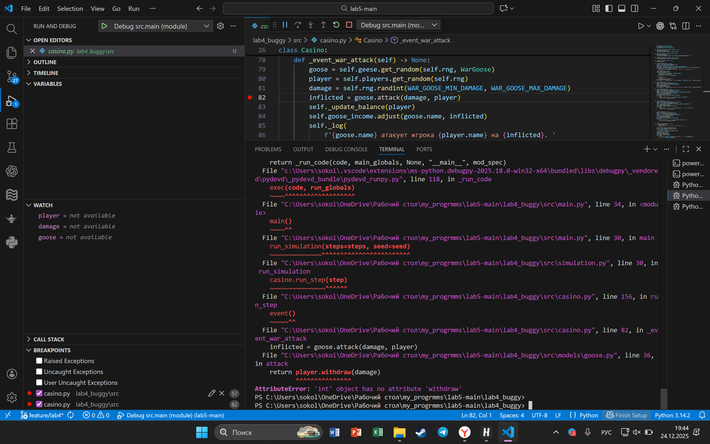
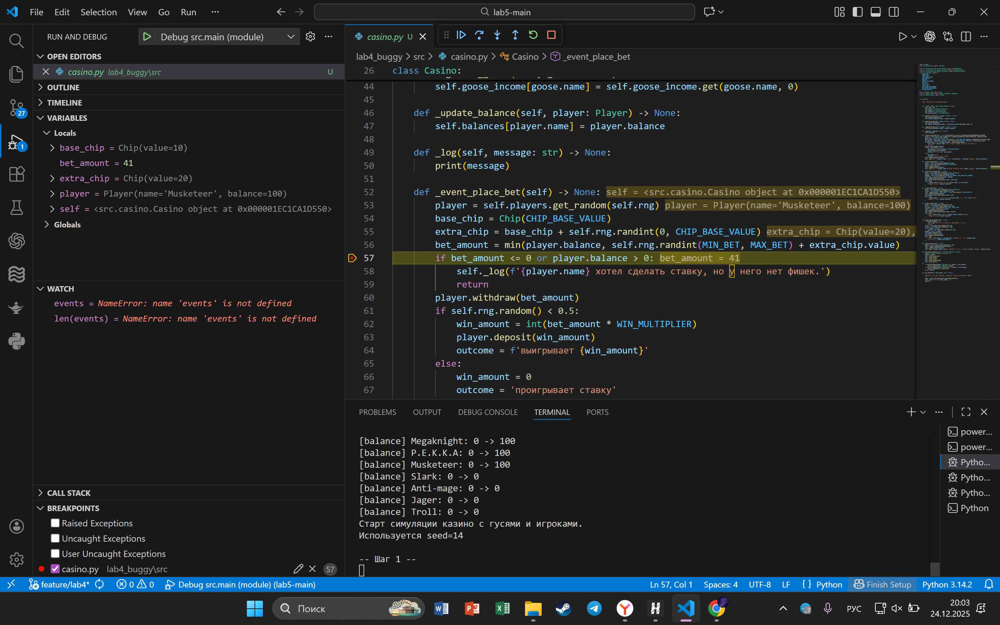
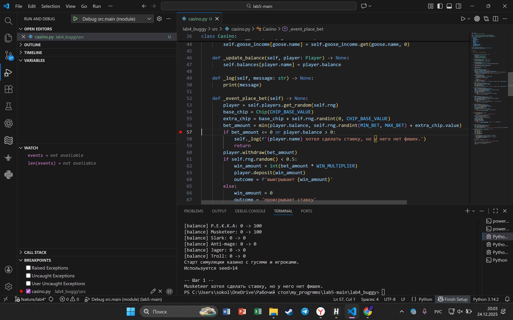

# Лабораторная работа 5 — отладка Python-проекта

Цель работы:
- закрепление навыков работы с отладчиком;
- понимание типовых логических и runtime-ошибок;
- освоение методики поиска, анализа и устранения ошибок;
- умение объяснять причину некорректного поведения программы.

Исходные данные:
- исходный проект из лабораторной работы №4 (симуляция казино);
- рабочая копия: `lab4_buggy` (в нее внесены ошибки).

Задание:
- скопировать исходный проект в отдельный каталог;
- намеренно внести не менее 5 типовых ошибок из допустимого списка;
- для каждой ошибки: воспроизвести, найти в отладчике (breakpoint, шаги, переменные, stack), исправить;
- оформить отчет со скриншотами точек останова, значениями переменных, стеком и описанием исправления.

Проект для работы:
- `lab4_buggy` (ошибки внесены; исправления выполняются по очереди в этой же папке)

Ниже — 5 типовых ошибок, все воспроизводимы при запуске симуляции.

---

### Ошибка 1 — off-by-one в количестве шагов
Место: `lab4_buggy/src/simulation.py`, `run_simulation`

Симптом:
Симуляция выполняет на 1 шаг меньше, чем задано. При `steps=1` симуляция не стартует.

Как воспроизвести:
1) Запустить `python -m src.main`
2) Ввести `3` (seed не нужен)
3) В выводе есть шаги `1` и `2`, шага `3` нет.

Отладка:
- breakpoint на строке цикла `for step in range(...)`
- проверить значения `steps` и рассчитанный диапазон

Причина:
Граница цикла выбрана неверно — последний шаг исключается.

Исправление:
В `lab4_buggy/src/simulation.py` исправить диапазон на `range(1, steps + 1)`.

Доказательства:
- 
- 

---

### Ошибка 2 — неправильный разбор пользовательского ввода
Место: `lab4_buggy/src/main.py`

Симптом:
При вводе двух чисел шаги и seed меняются местами.

Как воспроизвести:
1) Запустить `python -m src.main`
2) Ввести `10 19`
3) В отладчике видно: `steps=19`, `seed=10` (ожидалось наоборот).

Отладка:
- breakpoint на парсинге ввода
- проверить `parts`, `steps`, `seed`

Причина:
Неверный порядок присваивания для двух аргументов.

Исправление:
В `lab4_buggy/src/main.py` сделать разбор в порядке `steps`, затем `seed`.

Доказательства:
- 

---

### Ошибка 3 — перепутанные аргументы в атаке боевого гуся
Место: `lab4_buggy/src/casino.py`, `_event_war_attack`

Симптом:
Во время атаки возникает исключение `AttributeError: 'int' object has no attribute 'withdraw'`.

Как воспроизвести:
1) Запустить `python -m src.main`
2) Ввести `1 19` (steps=1, seed=19)
3) Программа падает на первом шаге.

Отладка:
- breakpoint в `_event_war_attack`
- проверить порядок аргументов при вызове `goose.attack(...)`
- посмотреть стек вызовов и значения `player`, `damage`

Причина:
Аргументы перепутаны местами: передается `damage` вместо `player`.

Исправление:
В `lab4_buggy/src/casino.py` исправить вызов на `goose.attack(player, damage)`.

Доказательства:
- 
- 

---

### Ошибка 4 — изменяемое значение по умолчанию в списке событий
Место: `lab4_buggy/src/casino.py`, `available_events`

Симптом:
Список событий растет при каждом вызове, вероятности событий искажаются.

Как воспроизвести:
1) Запустить `python -m src.main`
2) Ввести `3 1` (steps=3, seed=1)
3) В отладчике видно, что `len(events)` увеличивается каждый шаг.

Отладка:
- breakpoint в `available_events`
- посмотреть `events` на каждом шаге

Причина:
Использован изменяемый аргумент по умолчанию (`events=[]`), который сохраняет состояние между вызовами.

Исправление:
В `lab4_buggy/src/casino.py` создать список внутри функции без аргумента по умолчанию.

Доказательства:
- 
- 

---

### Ошибка 5 — неверное логическое условие (ставка никогда не происходит)
Место: `lab4_buggy/src/casino.py`, `_event_place_bet`

Симптом:
Событие ставки всегда завершается досрочно, баланс игрока не меняется.

Как воспроизвести:
1) Запустить `python -m src.main`
2) Ввести `1 14` (steps=1, seed=14)
3) Видно, что ставка не происходит (ранний выход из события).

Отладка:
- breakpoint на условии `if bet_amount <= 0 or player.balance > 0`
- проверить `bet_amount` и `player.balance`

Причина:
Условие содержит лишнюю часть `or player.balance > 0`, что делает его всегда истинным.

Исправление:
В `lab4_buggy/src/casino.py` заменить условие на `if bet_amount <= 0:`.

Доказательства:
- 
- 
